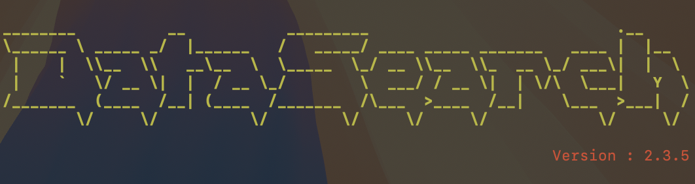
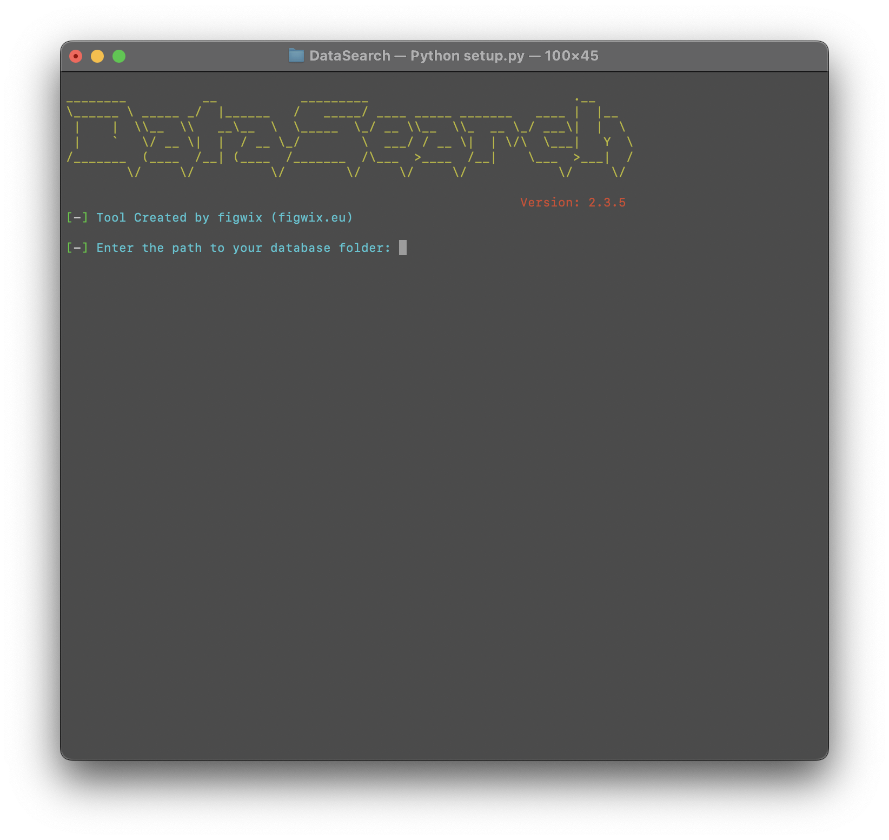
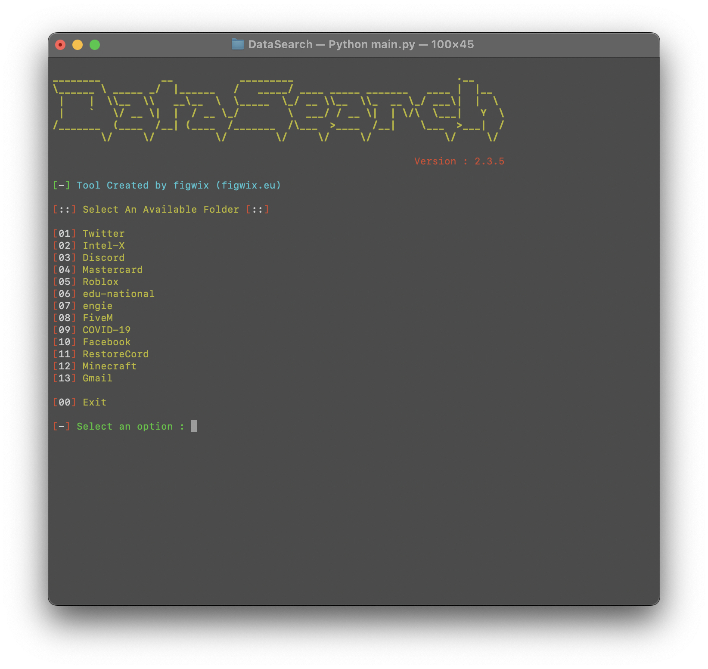
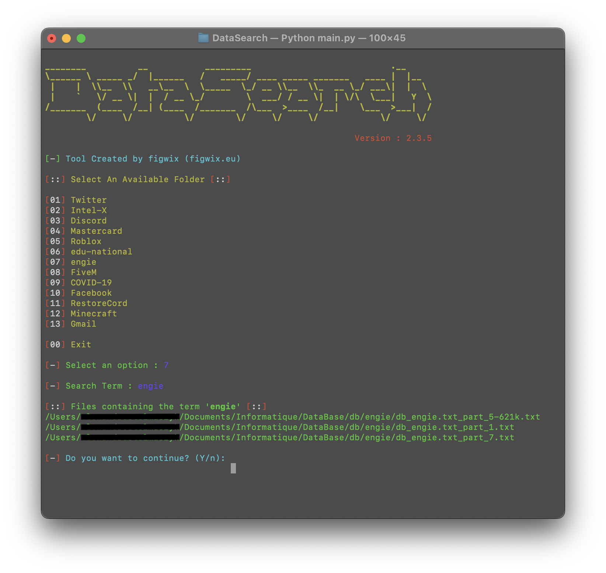
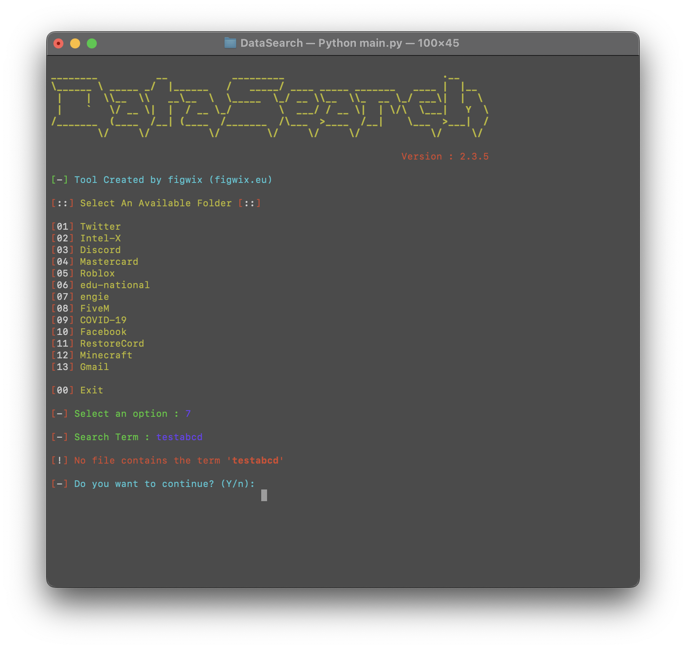

 

<h1 align="center">DataSearch</h1>

<p align="center">
   <a href="https://figwix.eu">Website</a>
</p>

<p>
  
  - Developed in <strong>Python</strong>, by <a href="https://figwix.eu">figwix</a><br>
  - Tool in <strong>English</strong>.<br>
  - Available on <strong>MacOS</strong>, <strong>Windows</strong> and <strong>Linux</strong>.<br>
  - <strong>No malware</strong> or <strong>backdoor</strong>.<br>
  - <strong>Open Source</strong> only for verification, ensuring no malicious programs.<br>
  - <strong>Frequently updated</strong>.<br>
  - <strong>Free</strong> for everyone.<br>
  <br><br>
</p>

<h1 align="center">Tools</h1>

<p align="center">
   
   
   
  
  <br><br>
</p>

<h1 align="center">Features</h1>
<p>
   
```
.
├── main.py
├── setup.py
├── config.txt
├── README.md
└── requirements.txt
```
<br><br>
</p>

<h1 align="center">Requirements</h1>

<h3>MacOS:</h3>

<p>
- Latest version of <a href="https://www.python.org/downloads/">Python</a>.<br>
- Linux recent version.
</p>

<h3>Windows:</h3>

<p>
- Install <a href="https://www.python.org/downloads/">Python</a> with the <a href="Img/Python_Path.png">PATH</a> options.<br>
- Windows 10 & 11 or +
</p>

<h3>Linux:</h3>

<p>
- Latest version of <a href="https://www.python.org/downloads/">Python</a>.<br>
- Linux recent version.
<br><br>
</p>

<h1 align="center">Installation</h1>

<a href="https://github.com/figwix/DataSearch/archive/refs/heads/main.zip">Dowloads "DataSearch.zip" Here</a>

<p>
  
```
1 - Download the .zip folder.
2 - Unzip the folder.
3 - Launch "setup.py".
```
Or
```
1 - Open a terminal.
2 - Write "git clone https://github.com/figwix/DataSearch.git"
3 - Write "cd DataSearch"
4 - Write "python3 setup.py"
5 - Write "python3 main.py"
```
<br><br>
</p>

<h1 align="center">Disclaimer</h1>

<p>
  
  - DataSearch Tools has been developed solely for educational purposes.<br>
  - This project has been created with good intentions and is intended for personal use only.<br>
  - By choosing to use DataSearch, you acknowledge and accept full responsibility for any consequences that may result from your actions.
</p>
